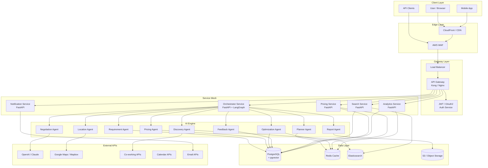

# Coworking AI Platform - System Architecture

## High-Level Architecture



## Data Flow

1. **User Input** -> Frontend captures natural language requirements
2. **API Gateway** -> Authenticates, rate-limits, routes to Orchestrator
3. **Orchestrator** -> Runs the agent execution graph:
   - Requirement Understanding Agent parses input
   - Planner Agent creates execution plan
   - Discovery Agent searches workspaces
   - Pricing Agent calculates TCO
   - Optimization Agent ranks recommendations
   - Report Agent generates summary
4. **Response** -> Top 10 recommendations with reasoning, costs, pros/cons
5. **Feedback Loop** -> User feedback updates preference memory

## Scoring Engine

```
Final Score = 
  0.25 * Cost Efficiency +
  0.15 * Accessibility +
  0.15 * Amenities +
  0.15 * Scalability +
  0.15 * Employee Comfort +
  0.15 * Infrastructure Reliability
```

Weights are configurable per tenant and learned from user feedback.

## Multi-Tenancy

- Tenant isolation via `tenant_id` in all tables
- Separate vector collections per tenant
- RBAC: Admin, Manager, Member, Viewer
- API quota management per tenant plan

## Deployment Architecture

### Development
```bash
docker-compose up
```

### Staging / Production (Kubernetes)
```
AWS EKS
  |- 2+ Orchestrator pods (HPA: 2-10)
  |- 2+ Gateway pods (LoadBalancer)
  |- 2+ Search pods
  |- 2+ Pricing pods
  |- RDS PostgreSQL (Multi-AZ in prod)
  |- ElastiCache Redis
  |- S3 for reports and assets
```

## Security Architecture

- JWT tokens with RS256
- OAuth2 / SSO integration
- mTLS between services (Istio optional)
- Secrets via Kubernetes Secrets / AWS Secrets Manager
- API rate limiting per tenant
- Audit logging for all actions
- Data encryption at rest (RDS) and in transit (TLS)
